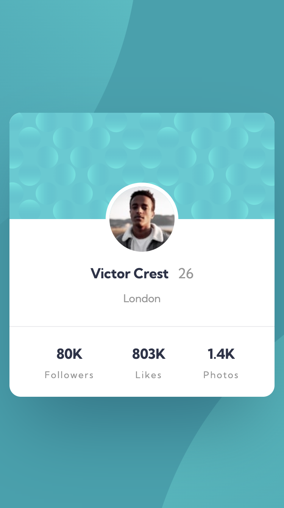
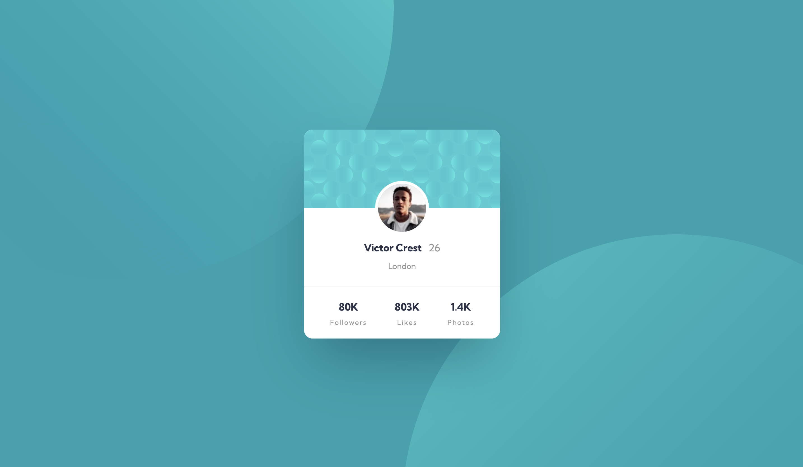

# Frontend Mentor - Profile card component solution

This is a solution to the [Profile card component challenge on Frontend Mentor](https://www.frontendmentor.io/challenges/profile-card-component-cfArpWshJ). 

### Screenshot

**Mobile**


**Desktop**



### Links

- Live Site URL: [Add live site URL here](https://fm-profile-card-component-dsen.netlify.app/)

## My process

### Built with

- HTML (Semantic HTML5 markup)
- CCS (CSS custom properties)
- Flexbox
- Mobile-first workflow

### What I learned

- I added a global class selector for the reuse of flex. 
```css
.flex {
  display: flex;
  justify-content: center;
  align-items: center;
}
```

- I learned how to add multiple images to the background, and how to position them. 
```css
background: url(./images/bg-pattern-bottom.svg) top 50vh left 50vw no-repeat, url(./images/bg-pattern-top.svg) bottom 40vh right 51vw no-repeat;
background-color: var(--Dark-cyan);
```
